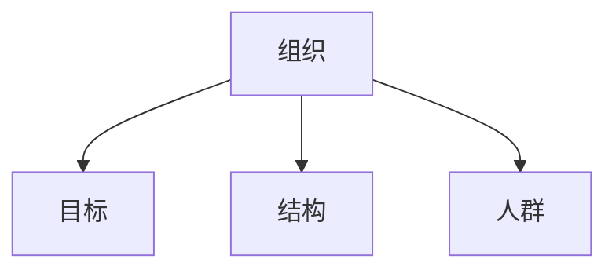
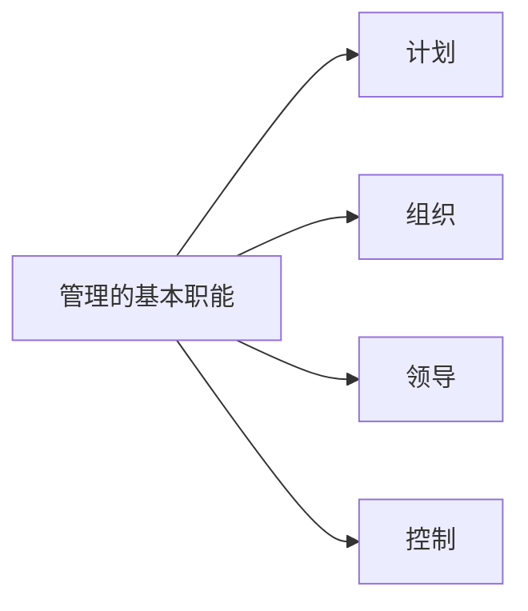

# 管理概述

[toc]

## 概念

### 组织：

> 由两个或两个以上的个人为了实现共同的目标组合而成的有机整体。

构成：

- 目标
- 结构
- 人群

组织目标

组织愿景

组织活动

结构：

- 管理者
- 操作者

### 管理

定义

> - 管理就是设计并保持一种良好的环境，使人在群体里高效地完成既定目标的过程。
> - 通过计划。组织。领导和控制组织资源以高效地实现目标组织的过程
> - 管理是指和别人一起，或通过别人使活动完成得更有效的过程

含义

> 在特定的环境下，对组织所拥有的的资源进行有效地计划、组织领导和控制，以便达到既定的组织目标的过程。

本质

通过他人并使他人童子鸡一起实现组织的目标。

## 管理的职能

计划职能的四个基本问题

- 使命（我是谁？）
- 价值观（我的处事原则是什么？）
- 愿景（我要到哪里去？）
- 战略（我如何到那里去）
