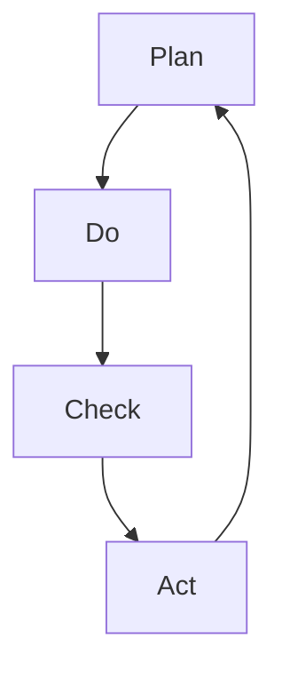

# 第五章 质量管理

## 质量管理，发展历史

1. 1875 年之前，放任管理
2. 1875 年之后，==泰勒制==科学管理

管理：

1. 精益 6r 指令管理

## 质量定义

- 朱兰（Juran）：适用性，产品和服务满足顾客要求的程度。
- 戴明（PDCA）：对适用性的 8 点解释
  - 性能
  - 附加功能
  - 可靠性
  - 一致性
  - 耐久性
  - 维护性
  - 美学性
  - 感觉性

## PDCA 循环

## ISO 9000

## 六西格玛管理方法
